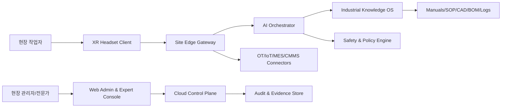
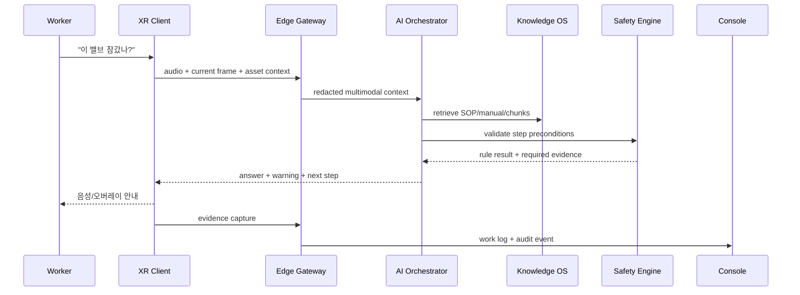

# 전체 시스템 아키텍처

## C4 Context

## 핵심 원칙

1. **Safety first**: 안전 관련 판단은 LLM 단독으로 실행하지 않는다. 정책 룰, 신뢰도, 센서 근거, 사람 승인 조건을 결합한다.
2. **Grounded guidance**: 모든 절차 안내는 문서 버전, SOP 단계, 장비 ID, 작업 조건에 근거를 연결한다.
3. **Edge-first latency**: 위험 경고와 시각 인식은 현장 엣지 또는 온디바이스에서 낮은 지연으로 처리한다.
4. **Cloud-governed**: 지식 버전, 권한, 감사, KPI, 모델 배포는 중앙에서 관리한다.
5. **Device abstraction**: Quest, Vision Pro, HoloLens, RealWear 등 기기별 차이를 Adapter로 숨긴다.

## 주요 컴포넌트

### XR Client
- MR overlay renderer
- voice ASR/TTS client
- hand/gaze/pose event publisher
- object/marker/QR capture
- offline task cache
- safety warning UI

### Site Edge Gateway
- low-latency CV inference
- video frame redaction
- local RAG cache
- OT protocol connector
- network failover queue
- device policy sync

### AI Orchestrator
- multimodal context builder
- RAG retriever/reranker
- procedure state machine
- tool/function calling router
- answer generator with citations
- escalation decision maker

### Industrial Knowledge OS
- document ingestion pipeline
- SOP graph compiler
- asset hierarchy and BOM graph
- document approval workflow
- versioned embedding store

### Safety & Policy Engine
- step precondition validation
- PPE/LOTO rule evaluation
- high-risk operation gate
- confidence thresholding
- supervisor approval workflow
- incident/near-miss logging

### Enterprise Control Plane
- tenant/site/device/user management
- SSO/RBAC/ABAC
- audit log and evidence retention
- deployment management
- KPI and ROI dashboard

## 데이터 흐름

## 배포 형태

| 형태 | 권장 고객 | 장점 | 단점 |
|---|---|---|---|
| Cloud SaaS | 일반 제조/교육 | 빠른 구축, 낮은 운영 부담 | 보안 구역 제약 |
| Edge + Cloud | 공장/병원 | 지연 감소, 원본 영상 통제 | 엣지 장비 필요 |
| On-Prem | 항공/국방/고규제 | 데이터 통제 극대화 | 구축비/운영비 높음 |
