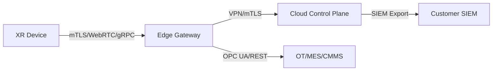

# 데이터 흐름과 보안 설계

## 데이터 분류

| 데이터 | 예시 | 기본 처리 |
|---|---|---|
| P0 공개 | 일반 제품 소개 | 자유 공유 |
| P1 내부 | SOP, 교육자료 | 테넌트 내부 접근 |
| P2 민감 | 장비 도면, 생산 조건 | 암호화, RBAC, 다운로드 제한 |
| P3 고민감 | 영상, 작업자 음성, 환자/고객정보 | 최소 수집, 엣지 처리, 보존 제한 |
| P4 규제 | 의료정보, 영업비밀, 국방 데이터 | 온프레미스, 별도 키, 감사 필수 |

## 영상/음성 처리 원칙

- 실시간 추론에 필요한 frame만 sampling한다.
- 사람 얼굴, 배지, 화면 속 개인정보는 엣지에서 redaction한다.
- 원본 영상 저장은 고객 정책으로 opt-in 처리한다.
- 기본 증거는 short clip이 아니라 still image + metadata + model result + human confirmation으로 저장한다.
- 음성은 STT 후 원본 audio를 즉시 폐기하는 모드를 기본값으로 둔다.

## 인증/권한

- SSO: SAML/OIDC
- 권한: RBAC + ABAC
- ABAC 예시: `site_id`, `asset_class`, `risk_level`, `shift`, `certification_level`
- 고위험 작업 승인: 2인 승인, supervisor role, 시간 제한 token

## 감사 로그

모든 주요 이벤트는 append-only 형태로 저장합니다.

```json
{
  "event_type": "safety.rule.blocked",
  "tenant_id": "acme",
  "site_id": "plant_01",
  "asset_id": "compressor_A7",
  "worker_id_hash": "sha256:...",
  "procedure_id": "SOP-LOTO-004",
  "step_id": "step_07",
  "policy_id": "PPE_REQUIRED_FACE_SHIELD",
  "model_confidence": 0.91,
  "decision": "BLOCK",
  "evidence_ids": ["ev_123"],
  "timestamp": "2026-06-24T09:00:00+09:00"
}
```

## 네트워크 구간


