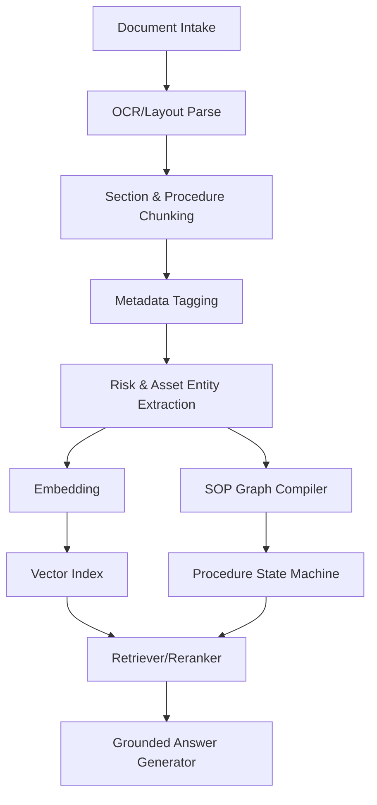

# 산업 지식 RAG 파이프라인

## 목표

일반적인 PDF Q&A가 아니라, 장비·작업오더·현재 단계·위험 조건을 반영해 **작업 가능한 답변**을 생성합니다.

## 입력 데이터

- 장비 매뉴얼 PDF
- SOP/작업표준서
- 위험성 평가표/JSA
- 에러코드 목록
- 부품 BOM/CAD 메타데이터
- CMMS 정비 이력
- 품질 검사 기준서
- 교육 자료/동영상 transcript
- 숙련자 인터뷰 노트

## 파이프라인



## Chunk 설계

일반 문단 단위가 아니라 절차 단위로 자릅니다.

```json
{
  "chunk_id": "manual_A7_p37_step_04",
  "asset_model": "Compressor-A7",
  "doc_id": "MAN-A7-2026",
  "doc_version": "v3.2",
  "page": 37,
  "section": "Filter replacement",
  "step_number": 4,
  "action": "Close valve V-302",
  "preconditions": ["Pump P-2 power off", "LOTO applied"],
  "hazards": ["stored pressure", "chemical exposure"],
  "required_ppe": ["gloves", "face_shield"],
  "evidence_required": ["valve_closed_visual", "pressure_zero"],
  "text": "..."
}
```

## Retrieval Query Context

```json
{
  "user_question": "이 밸브 잠갔나?",
  "asset_id": "compressor_A7",
  "work_order_id": "WO-2026-01821",
  "current_step_id": "SOP-LOTO-004:07",
  "detected_objects": ["valve_V302", "pressure_gauge_G12"],
  "sensor_values": {"pressure_bar": 0.1},
  "worker_certifications": ["LOTO_BASIC"],
  "site_policy_version": "EHS-2026.04"
}
```

## 답변 생성 원칙

- 답변에는 항상 근거 문서/단계/버전을 연결한다.
- 불확실하면 단정하지 않고 재촬영/전문가 확인을 요청한다.
- 안전 관련 질문에는 먼저 위험 조건을 확인한다.
- “가능합니다”보다 “다음 조건이 충족되면 진행 가능합니다” 형태로 답한다.
- 문서와 현장 인식이 충돌하면 작업을 중지하고 불일치 리포트를 생성한다.

## RAG 평가

| 평가 항목 | 목표 |
|---|---|
| Top-5 retrieval hit rate | 90%+ |
| citation correctness | 95%+ |
| hallucination rate | 2% 이하, 안전 도메인은 0에 가깝게 |
| refusal appropriateness | 위험/불확실 상황에서 보수적 판단 |
| answer latency | 일반 Q&A 3초 내, 긴 절차 요약 8초 내 |
