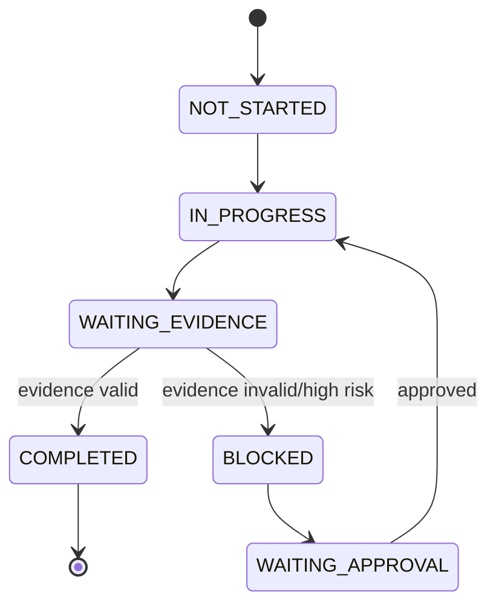

# 체크리스트/절차 엔진

## 목적

작업을 단순 목록이 아니라 상태 기계(state machine)로 관리합니다. 각 단계는 전제 조건, 필요 증거, 위험도, 승인 조건, 예외 분기를 가집니다.

## Step 스키마

```yaml
procedure_id: SOP-LOTO-004
version: 3.2
asset_model: Compressor-A7
steps:
  - step_id: step_01
    title: 작업 오더 확인
    risk_level: LOW
    required_evidence: [work_order_opened]
    next: step_02
  - step_id: step_02
    title: PPE 착용 확인
    risk_level: MEDIUM
    required_ppe: [gloves, face_shield]
    required_evidence: [ppe_visual_check]
    on_fail: block_ppe_missing
    next: step_03
  - step_id: step_03
    title: 전원 차단 및 LOTO 적용
    risk_level: HIGH
    preconditions: [asset_identified]
    required_evidence: [breaker_off_visual, lock_tag_visual]
    approval: supervisor_optional_by_policy
    next: step_04
```

## 상태 전이



## 체크리스트 타입

| 타입 | 예시 | 검증 방식 |
|---|---|---|
| self-confirm | “작업 오더 확인” | 작업자 음성/버튼 |
| visual-confirm | “밸브 닫힘 확인” | 객체 인식 + 작업자 확인 |
| sensor-confirm | “압력 0 bar” | 센서/계기 OCR |
| dual-confirm | “LOTO 적용” | evidence + supervisor |
| system-confirm | “CMMS 상태 closed” | API 상태 |

## 예외 처리

- 부품 없음: 작업 보류 + 자재 요청
- 문서 불일치: 관리자 승인 또는 변경 요청
- 위험 조건 미충족: BLOCK
- 인식 실패: 재촬영 안내 → 수동 확인 → 전문가 호출
- 반복 실패: 현장 감독자 알림
