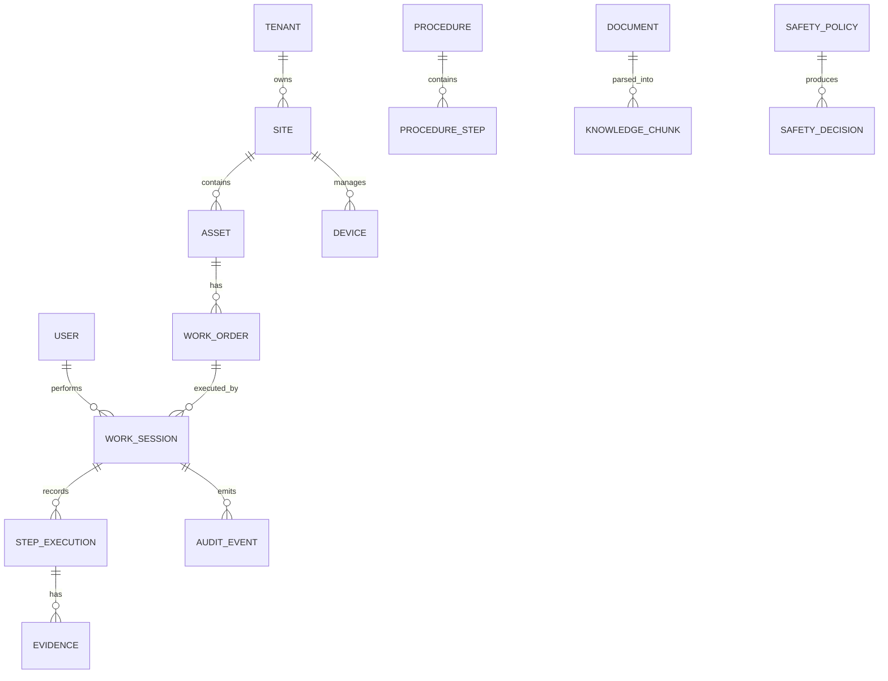

# 데이터 모델

## 핵심 엔티티

## 엔티티 설명

| 엔티티 | 설명 |
|---|---|
| Tenant | 고객사 |
| Site | 공장/병원/정비센터 |
| Asset | 장비/설비/부품 계층 |
| Device | XR 기기/엣지 기기 |
| User | 작업자/관리자/전문가 |
| WorkOrder | 작업 지시 |
| Procedure | SOP/작업절차 |
| ProcedureStep | 절차 단계 |
| WorkSession | 실제 작업 수행 세션 |
| Evidence | 이미지, OCR, 센서, 음성메모, 확인 로그 |
| KnowledgeChunk | RAG 검색 단위 |
| SafetyPolicy | 안전 정책 룰 |
| AuditEvent | 변경 불가능한 감사 이벤트 |

## 상태 값

### WorkSession
- CREATED
- PRECHECK
- IN_PROGRESS
- BLOCKED
- WAITING_APPROVAL
- ESCALATED
- COMPLETED
- CANCELLED

### StepExecution
- NOT_STARTED
- IN_PROGRESS
- WAITING_EVIDENCE
- COMPLETED
- FAILED
- BLOCKED
- SKIPPED_WITH_APPROVAL

### SafetyDecision
- ALLOW
- CAUTION
- BLOCK
- REQUIRE_APPROVAL
- EMERGENCY_STOP
