# CI/CD와 관측성

## CI 파이프라인

```mermaid
flowchart LR
    Commit --> Unit[Unit Tests]
    Unit --> Contract[API Contract Tests]
    Contract --> Safety[Safety Regression Tests]
    Safety --> Rag[RAG Eval]
    Rag --> Build[Container/Unity Build]
    Build --> Security[Security Scan]
    Security --> Stage[Staging Deploy]
    Stage --> Pilot[Pilot Ring]
    Pilot --> Prod[Production Ring]
```

## 테스트 종류

- API contract test
- SOP graph validation
- safety rule regression
- RAG golden question set
- prompt injection test
- XR UI smoke test
- network disconnect test
- edge failover test
- privacy redaction test

## 배포 링

| Ring | 대상 | 목적 |
|---|---|---|
| dev | 내부 개발 | 빠른 반복 |
| staging | QA/SME | 기능 검증 |
| pilot | 1개 라인/소수 기기 | 현장 검증 |
| production | 전체 현장 | 안정 운영 |

## 관측 지표

### Technical
- API latency
- AI answer latency
- CV inference latency
- headset FPS/battery/thermal
- network packet loss
- edge queue depth

### Safety/Quality
- safety blocked count
- warning acceptance rate
- false positive reports
- evidence completion rate
- procedure override count

### Product
- DAU/WAU per site
- sessions per headset
- avg steps per session
- expert escalation rate
- time saved per work order

## 로그 보존

- 일반 telemetry: 30~90일
- 안전/품질 evidence: 고객 정책에 따라 180일~7년
- AI prompt/response: 민감도에 따라 redaction 후 보관
- 원본 영상/음성: 기본 미보관, opt-in만 제한 저장
